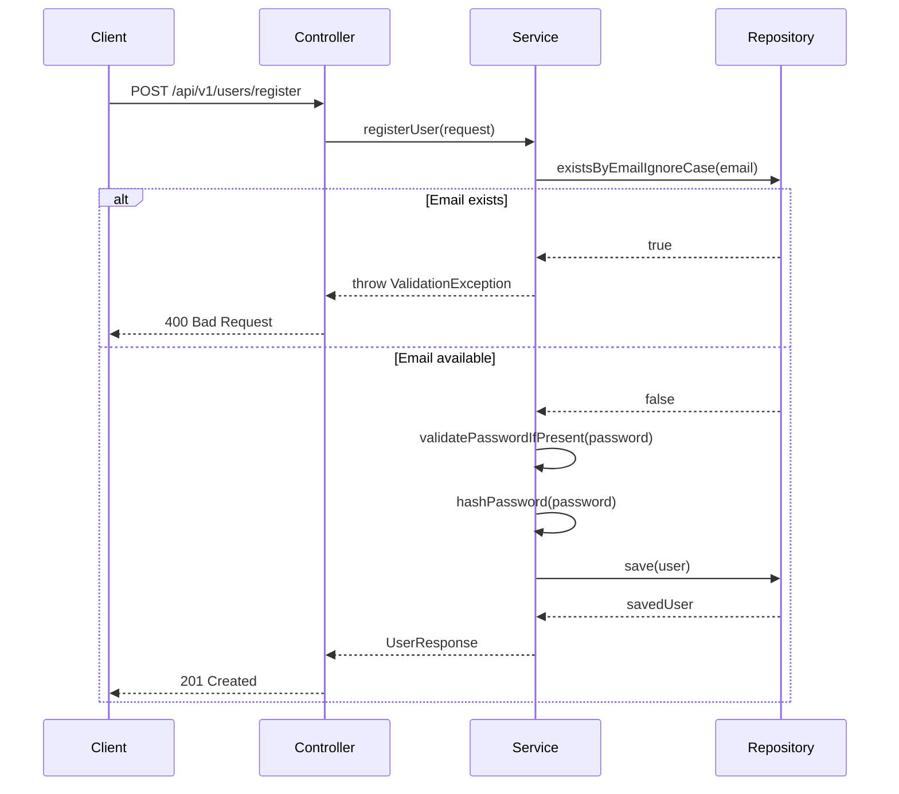

# Dating App - System Patterns

> **Related Documents**: 
> - [Technical Context](./tech-context.md) for implementation details
> - [Decision Log](./decision-log.md) for architectural decisions
> - [Open Questions](./open-questions.md) for pending technical decisions

## System Architecture

### High-Level Architecture
```
┌─────────────────┐     ┌─────────────────┐     ┌─────────────────┐
│                 │     │                 │     │                 │
│  Mobile Client  │ ◄──►│  API Gateway    │ ◄──►│  Auth Service   │
│                 │     │                 │     │                 │
└─────────────────┘     └─────────────────┘     └─────────────────┘                                       
         ▲                       ▲
         │                       │
         ▼                       ▼
┌─────────────────┐     ┌─────────────────┐
│                 │     │                 │
│  Web Client     │     │  User Service   │
│                 │     │                 │
└─────────────────┘     └─────────────────┘
                                               
```

### Technology Stack
- **Frontend**: React Native (mobile), React (web)
- **Backend**: Kotlin/Spring Boot
- **Database**: MongoDB (user data), Redis (caching)

## User Registration Flow

### Registration Endpoint
- **Path**: `POST /api/v1/users/register`
- **Authentication**: None (public endpoint)
- **Request Validation**:
  ```kotlin
  data class UserRegistrationRequest(
      @field:NotBlank val name: String,
      @field:Email @field:NotBlank val email: String,
      @field:Size(min = 8) val password: String? = null,
      @field:Min(18) @field:Max(120) val age: Int,
      @field:NotBlank val gender: String,
      @field:Valid val location: LocationRequest,
      @field:Valid val preferences: PreferencesRequest
  )
  ```

### Validation Rules
1. **Email**: Must be unique and valid format
2. **Password**: Optional, but if provided must be at least 8 characters
3. **Age**: Must be between 18 and 120
4. **Location**: Must include city and country
5. **Preferences**: Must include interestedIn, minAge, and maxAge

### Error Responses
- `400 Bad Request`: Invalid input data (with detailed error messages)
- `409 Conflict`: Email already exists
- `500 Internal Server Error`: Server error (logged for debugging)

### Security Considerations
- Passwords are hashed using BCrypt before storage
- Email verification will be implemented in a future release
- Rate limiting should be implemented to prevent abuse
- **Search**: Elasticsearch (for advanced matching)
- **Messaging**: WebSockets for real-time chat
- **Storage**: AWS S3 for media files

## Testing Architecture

### Overview
Our testing strategy follows a pyramid approach with a strong emphasis on unit tests, supported by integration and end-to-end tests. We use MockK for mocking in unit tests and Testcontainers for integration tests.

### User Registration Flow



#### Key Features:
1. **Optional Password**: Passwords are optional to support social login flows
2. **Email Uniqueness**: Email is used as the primary identifier and must be unique
3. **Input Validation**: Comprehensive validation of all input fields
4. **Error Handling**: Clear error messages for validation failures
5. **Password Security**: Passwords are hashed before storage

### Testing Pyramid
```
          /
         /  \
        /    \
       /      \
      /        \
     /__________\
    Unit  Integration  E2E
   70%      25%         5%
```

### Unit Testing Patterns

#### Test Structure
```kotlin
@ExtendWith(MockKExtension::class)
class UserServiceTest {
    
    @MockK
    private lateinit var userRepository: UserRepository
    
    @InjectMockKs
    private lateinit var userService: UserService
    
    @BeforeEach
    fun setup() {
        MockKAnnotations.init(this)
    }
    
    @Test
    fun `should register user when request is valid`() {
        // Arrange
        val request = createValidUserRequest()
        every { userRepository.existsByEmail(any()) } returns false
        every { userRepository.save(any()) } returnsArgument 0
        
        // Act
        val result = userService.registerUser(request)
        
        // Assert
        assertThat(result).isNotNull()
        verify(exactly = 1) { userRepository.save(any()) }
    }
}
```

#### Key Patterns
1. **Test Data Factory**
   - Centralized test data creation
   - Reduces duplication
   - Improves test maintainability

2. **Mocking with MockK**
   - Use `every` for stubbing
   - Use `verify` for behavior verification
   - Prefer relaxed mocks for complex objects

### Integration Testing Patterns

#### Test Containers Example
```kotlin
@Testcontainers
@SpringBootTest
class UserRepositoryIT {
    
    @Container
    private val mongoDBContainer = MongoDBContainer("mongo:6.0")
    
    @Autowired
    private lateinit var userRepository: UserRepository
    
    @BeforeEach
    fun setup() {
        userRepository.deleteAll()
    }
    
    @Test
    fun `should save and retrieve user`() {
        // Given
        val user = TestDataFactory.createUser()
        
        // When
        val savedUser = userRepository.save(user)
        val foundUser = userRepository.findById(savedUser.id!!).orElse(null)
        
        // Then
        assertThat(foundUser).isNotNull()
        assertThat(foundUser?.email).isEqualTo(user.email)
    }
}
```

### API Testing Patterns

#### Controller Test Example
```kotlin
@WebMvcTest(UserController::class)
@ExtendWith(MockKExtension::class)
class UserControllerIT {
    
    @Autowired
    private lateinit var mockMvc: MockMvc
    
    @MockK
    private lateinit var userService: UserService
    
    @Test
    fun `should return 201 when user is created`() {
        // Given
        val request = TestDataFactory.createUserRegistrationRequest()
        val response = TestDataFactory.createUserResponse(TestDataFactory.createUser())
        
        every { userService.registerUser(any()) } returns response
        
        // When / Then
        mockMvc.perform(
            post("/api/v1/users/register")
                .contentType(MediaType.APPLICATION_JSON)
                .content(objectMapper.writeValueAsString(request))
        )
            .andExpect(status().isCreated)
            .andExpect(jsonPath("$.id").exists())
    }
}
```

## Authentication Service

### Overview
The authentication service handles user registration, login, and session management. It's implemented as a separate microservice for better scalability and security.

### Key Components

1. **JWT Token Generation**
   - Uses asymmetric encryption (RS256)
   - Short-lived access tokens (15 minutes)
   - Long-lived refresh tokens (7 days)
   - Token blacklisting for logout

2. **Password Security**
   - BCrypt hashing with work factor 12
   - Rate limiting on login attempts
   - Account lockout after multiple failed attempts

3. **Session Management**
   - Redis-backed session storage
   - Device fingerprinting
   - Session invalidation on password change

### API Endpoints
- `POST /api/v1/auth/register` - Register new user
- `POST /api/v1/auth/login` - User login
- `POST /api/v1/auth/refresh` - Refresh access token
- `POST /api/v1/auth/logout` - Invalidate tokens

For more details, see the [Authentication Decision](./decision-log.md#2025-05-18---authentication-mechanism) in the decision log.

## Design Patterns

### Repository Pattern
- Used for data access abstraction
- Provides a clean API for data operations
- Makes testing easier by allowing mock implementations

### Service Layer Pattern
- Business logic is encapsulated in service classes
- Controllers remain thin, delegating to services
- Improves testability and maintainability

### Observer Pattern
- Used for real-time notifications
- Notifies users of new matches and messages
- Decouples the notification logic from core business logic

## API Specifications

### Base URL
`https://api.datingapp.com/v1`

### Authentication
- JWT-based authentication
- Token refresh mechanism
- Role-based access control

### Endpoints

#### Authentication
- `POST /auth/register` - Register new user
- `POST /auth/login` - User login
- `POST /auth/refresh` - Refresh access token

#### User Profile
- `GET /users/me` - Get current user profile
- `PUT /users/me` - Update profile
- `GET /users/{id}` - Get user by ID

#### Matching
- `GET /matches` - Get matches
- `POST /matches/{id}/like` - Like a user
- `POST /matches/{id}/pass` - Pass on a user

## API Design Pattern

### Controller-Service-Repository Pattern

1. **Controller Layer**
   - Handles HTTP requests and responses
   - Performs input validation
   - Maps between API models and internal DTOs
   - Example:
     ```kotlin
     @RestController
     @RequestMapping("/api/v1/users")
     class UserController(
         private val userService: UserService
     ) {
         @PostMapping
         fun registerUser(
             @Valid @RequestBody request: UserRegistrationRequest
         ): ResponseEntity<UserResponse> {
             // Map to internal DTO and delegate to service
         }
     }
     ```

2. **Service Layer**
   - Contains business logic
   - Coordinates between different repositories
   - Handles transactions
   - Example:
     ```kotlin
     @Service
     class UserService(
         private val userRepository: UserRepository
     ) {
         fun registerUser(dto: UserRegistrationDto): User {
             // Business logic here
         }
     }
     ```

3. **Repository Layer**
   - Handles data access
   - Extends Spring Data MongoDB's `MongoRepository`
   - Example:
     ```kotlin
     @Repository
     interface UserRepository : MongoRepository<User, String> {
         fun findByEmail(email: String): User?
     }
     ```

### DTO Pattern
- **Request DTOs**: For incoming API requests
  - Validates input
  - Matches API contract
- **Response DTOs**: For API responses
  - Controls what data is exposed
  - Matches API contract
- **Internal DTOs**: For service layer communication
  - Matches domain model
  - May contain additional metadata

## Data Models

### User
```kotlin
data class User(
    val id: String,
    val email: String,
    val name: String,
    val birthDate: LocalDate,
    val gender: Gender,
    val bio: String?,
    val interests: List<String>,
    val location: GeoJsonPoint,
    val photos: List<Photo>,
    val preferences: UserPreferences,
    val isVerified: Boolean,
    val createdAt: Instant,
    val updatedAt: Instant
)
```

### Match
```kotlin
data class Match(
    val id: String,
    val user1Id: String,
    val user2Id: String,
    val matchedAt: Instant,
    val lastMessage: Message?,
    val isActive: Boolean
)
```

## Database Schema

### Users Collection
```
{
  _id: ObjectId,
  email: String,
  passwordHash: String,
  name: String,
  birthDate: Date,
  gender: String,
  bio: String,
  interests: [String],
  location: { type: "Point", coordinates: [longitude, latitude] },
  photos: [
    {
      url: String,
      isPrimary: Boolean,
      uploadedAt: Date
    }
  ],
  preferences: {
    ageRange: { min: Number, max: Number },
    maxDistance: Number,
    genderPreference: [String]
  },
  isVerified: Boolean,
  createdAt: Date,
  updatedAt: Date
}
```

### Matches Collection
```
{
  _id: ObjectId,
  users: [ObjectId],
  matchedAt: Date,
  lastMessage: {
    senderId: ObjectId,
    content: String,
    sentAt: Date
  },
  isActive: Boolean
}
```

## Caching Strategy
- User profiles: 1 hour TTL
- Matches: 5 minutes TTL
- User preferences: 24 hours TTL

## Security Considerations
- All endpoints require authentication except /auth/*
- Rate limiting on authentication endpoints
- Input validation on all endpoints
- Data encryption at rest and in transit
- Regular security audits

## Performance Considerations
- Pagination for large result sets
- Database indexing on frequently queried fields
- Caching strategy for read-heavy operations
- Asynchronous processing for non-critical operations
